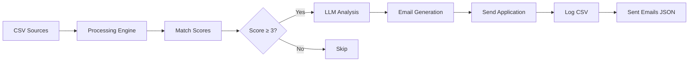

# Data Distribution Guide

*Import • Process • Automate*

## Data Flow Architecture



## Supported Data Formats

### Internships CSV (`data/internships.csv`)

| Column | Required | Description |
|--------|----------|-------------|
| `Title` | ✅ | Job title (e.g., "Software Intern") |
| `Company` | ✅ | Company name |
| `Description` | ✅ | Brief job description |
| `Requirements` | ✅ | Skills/requirements list |
| `Email` | ✅ | Contact email for applications |

### LinkedIn Jobs CSV (`data/linkedin_jobs.csv`)

```csv
title,company,location,url,postedDate,description
"Software Engineer Intern","Google","Mountain View, CA","https://...","2024-01-15","Build scalable systems..."
```

### Resume (`data/resume.txt` or `data/resume.pdf`)

Plain text or PDF format. The system extracts skills automatically.

## Automation Commands

### `/auto` - Full Pipeline

The one-command automation:

```
1. Reads data/internships.csv
2. Analyzes each job with LLM
3. Filters by match score
4. Sends applications (45s delay between emails)
5. Logs to logs/applications.csv
```

### `/search <keyword>` - Find Jobs

Searches `linkedin_jobs.csv` for matching positions:

```bash
/search software     # Software internships
/search frontend     # Frontend roles
/search remote       # Remote positions
```

### `/filter` - Score Matching

Filters loaded jobs against your resume. Uses skill matching + title weighting.

### `/analyze <job#>` - Deep Analysis

Provides match score, reasons to apply, and generated email.

## Output Files

| File | Purpose |
|------|---------|
| `matches/*.json` | Timestamped match snapshots |
| `logs/applications.csv` | All applications sent |
| `logs/sent-emails.json` | Email delivery logs |

### Match Snapshot Format

```json
{
  "timestamp": "2026-05-28T15:38:36.007Z",
  "total": 6,
  "matches": 4,
  "jobs": []
}
```

### Application Log Format

```csv
Timestamp,Company,Job Title,Match Score,Status,Email Sent To
2026-05-28T15:29:24,GlowAR,Product Management Intern,75,Applied,hr@glowar.com
```