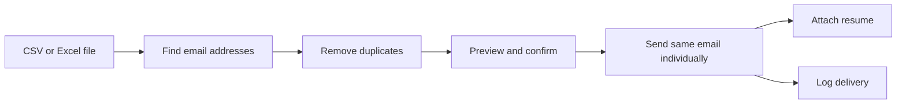

# Bulk Email Guide

*Find recipients • Preview • Send*

## Data Flow Architecture


```mermaid
flowchart LR
    A[CSV or Excel file] --> B[Find email addresses]
    B --> C[Remove duplicates]
    C --> D[Preview and confirm]
    D --> E[Send same email individually]
    E --> F[Attach resume]
    E --> G[Log delivery]
```

## Supported Data Formats

### Recipient file (`data/recipients.csv`, `.xlsx`, or `.xls`)

| Column | Required | Description |
|--------|----------|-------------|
| `Email` | Recommended | Email address column; other columns are allowed |

### Resume (`data/resume.txt` or `data/resume.pdf`)

The same resume is attached to every email.

## Automation Commands

### Send bulk emails

Choose **Send Bulk Emails** from the menu. Enter the recipient file, review the number of addresses found, and confirm. Each recipient receives a separate email with the same subject, body, and resume attachment.

## Output Files

| File | Purpose |
|------|---------|
| `matches/*.json` | Timestamped match snapshots |
| `logs/applications.csv` | All applications sent |
| `logs/sent-emails.json` | Email delivery logs |

### Match Snapshot Format

```json
{
  "timestamp": "2026-05-28T15:38:36.007Z",
  "total": 6,
  "matches": 4,
  "jobs": []
}
```

### Application Log Format

```csv
Timestamp,Company,Job Title,Match Score,Status,Email Sent To
2026-05-28T15:29:24,GlowAR,Product Management Intern,75,Applied,hr@glowar.com
```