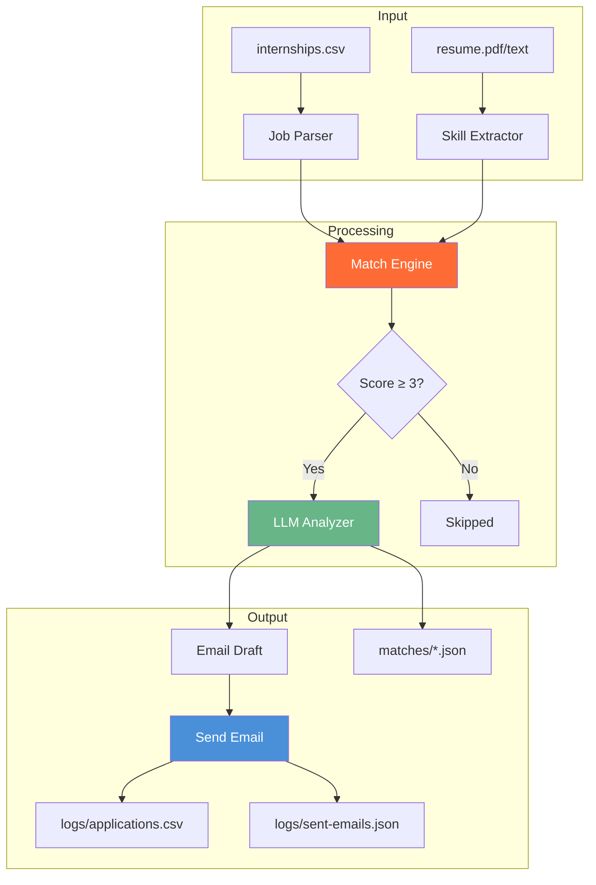

<div align="center">

# Internship Automation


### 🤖 Automated internship matching powered by LLMs

</div>

---

## 🎯 What It Does

Internship Automation automates your job hunt by:

| Step | Action |
|------|--------|
| 🔍 **Search** | Parse LinkedIn exports & CSV job listings |
| 🎯 **Match** | Score positions against your resume skills |
| 🤖 **Analyze** | LLM-powered fit analysis with email drafts |
| 📧 **Apply** | Auto-send applications with resume attached |
| 📊 **Track** | Log everything to CSV + JSON snapshots |

---

<div align="center">

### Live Demo


</div>

---

## 🚀 Quick Start

```bash
npm install
node src/client.js
```

```
🤖 INTERNSHIP AUTOMATION CLIENT
Commands:
  /search <keyword>     - Find internship listings
  /filter               - Score against your resume
  /analyze <job #>      - LLM fit analysis
  /send <job #> <email> - Send custom application
  /auto                 - FULL AUTOMATION MODE 🚀
```

---

## 📂 Project Structure

```
internship-automation/
├── data/
│   ├── internships.csv      # Your target positions
│   ├── linkedin_jobs.csv    # LinkedIn export
│   └── resume.pdf           # Your resume
├── src/
│   ├── server.js            # MCP server with 6 tools
│   └── client.js            # Interactive CLI client
├── matches/                 # Generated match snapshots
├── logs/
│   ├── applications.csv       # Application history
│   └── sent-emails.json       # Email logs
├── SETUP.md                 # Installation guide
└── GUIDE.md                 # Data distribution guide
```

---

## 🛠️ Available Tools

| Tool | Parameter | Description |
|------|-----------|-------------|
| `search_linkedin` | `keyword`, `location?` | Search jobs from CSV |
| `filter_jobs` | `jobs`, `resumeText` | Skill-based scoring |
| `send_application` | `to`, `jobTitle`, `company` | Send email via Gmail |
| `log_application` | `jobTitle`, `company`, `matchScore` | Track to CSV |
| `mistral_analyze_job` | `jobTitle`, `company`, `jobDescription`, `yourResume` | LLM analysis |
| `llm_chat` | `message` | Direct LLM chat |

---

## 🔧 Configuration

```env
# .env file
GMAIL_USER=your.email@gmail.com
GMAIL_APP_PASSWORD=xxxx-xxxx-xxxx-xxxx
OPENROUTER_API_KEY=sk-or-...
RESUME_PATH=data/resume.pdf
```

See [SETUP.md](./SETUP.md) for detailed setup.

---

## 📊 Data Distribution

The automation processes data through a clean pipeline:



Check [GUIDE.md](./GUIDE.md) for import formats and examples.

---

## 🎨 Features at a Glance


---

## 🤝 Contributing

Found a bug or want a feature? Open an issue or submit a PR. Keep changes focused and test thoroughly.

---

**License**: ISC • **Author**: Gaurav Sharma