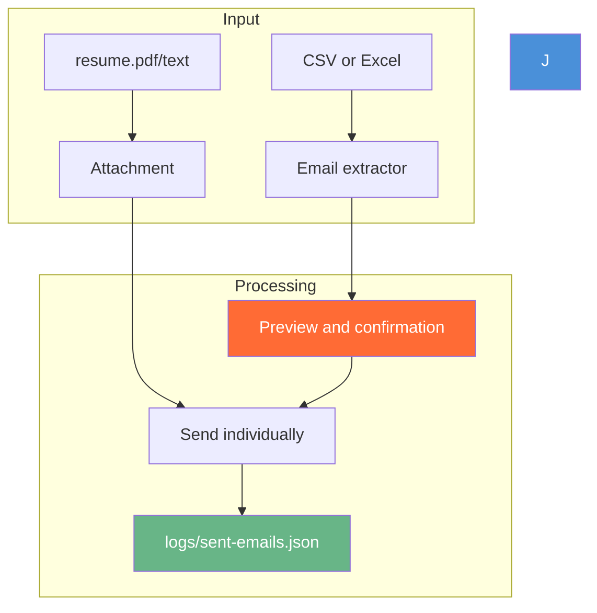

<div align="center">

# Internship Automation


### 📧 Send one application email to many recipients

</div>

---

## 🎯 What It Does

Internship Automation sends one fixed subject, body, and resume attachment to multiple recipients by:

| Step | Action |
|------|--------|
| 📄 **Read** | Extract email addresses from CSV or Excel files |
| 🧹 **Clean** | Remove duplicates and ignore invalid rows |
| 📧 **Send** | Send the same email separately to every recipient |
| 📎 **Attach** | Add the same resume to every email |
| 📊 **Track** | Log each delivery to JSON |

---

<div align="center">

### Live Demo


</div>

---

## 🚀 Quick Start

```bash
npm install
node src/client.js
```

```
🤖 INTERNSHIP AUTOMATION CLIENT
Choose `SEND BULK EMAILS` from the interactive menu, then provide a `.csv`, `.xlsx`, or `.xls` file.
```

---

## 📂 Project Structure

```
internship-automation/
├── data/
│   ├── recipients.csv       # Recipient list (CSV or Excel)
│   └── resume.pdf           # Your resume
├── src/
│   ├── server.js            # MCP server with 6 tools
│   └── client.js            # Interactive CLI client
├── matches/                 # Generated match snapshots
├── logs/
│   ├── applications.csv       # Application history
│   └── sent-emails.json       # Email logs
├── SETUP.md                 # Installation guide
└── GUIDE.md                 # Data distribution guide
```

---

## 🛠️ Available Tools

| Tool | Parameter | Description |
|------|-----------|-------------|
| `send_email` | `to`, `subject`, `body` | Send fixed email with resume via Gmail |

---

## 🔧 Configuration

```env
# .env file
GMAIL_USER=your.email@gmail.com
GMAIL_APP_PASSWORD=xxxx-xxxx-xxxx-xxxx
RESUME_PATH=data/resume.pdf
```

See [SETUP.md](./SETUP.md) for detailed setup.

---

## 📊 Sending Flow

The automation processes data through a clean pipeline:


```mermaid
flowchart TB
    subgraph Input
        A[CSV or Excel] --> B[Email extractor]
        C[resume.pdf/text] --> D[Attachment]
    end
    
    subgraph Processing
        B --> E[Preview and confirmation]
        D --> F[Send individually]
        E --> F
        F --> G[logs/sent-emails.json]
    end
    
    style E fill:#FF6B35,color:#fff
    style G fill:#68B587,color:#fff
    style J fill:#4A90D9,color:#fff
```

Check [GUIDE.md](./GUIDE.md) for import formats and examples.

---

## 🎨 Features at a Glance


---

## 🤝 Contributing

Found a bug or want a feature? Open an issue or submit a PR. Keep changes focused and test thoroughly.

---

**License**: ISC • **Author**: Gaurav Sharma